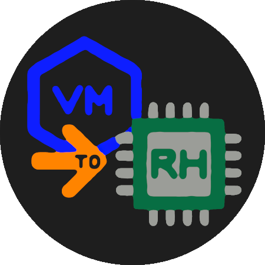

## vm-to-rh - Virtual Machine to Real Hardware



Have you ever thought about how cool it would be to prepare the entire setup of your work Operating System safely, calmly, with the comfort of a Virtual Machine and, most importantly, minimizing interruptions to your work?

This is the purpose of this guide. In it, we demonstrate how to transfer a Virtual Machine containing a desktop Operating System to a real hardware.

We used as a basis for the process the transfer of a Manjaro (KDE) Linux installed using btrfs filesystem for system partition on a Virtual Machine in VirtualBox using the help of a Manjaro Live DVD. However, the process, in general, can be adapted to other distributions and other usage scenarios.

Let's go for it! 😎

## Donations

Please consider to deposit a donation through PayPal by clicking on the next button...

[](https://www.paypal.com/donate/?hosted_button_id=TANFQFHXMZDZE)

This is free software and you are equally free to specify any amount of money you want.

**Support free software and my work!** ❤️🐧

## Table of Contents

   * [Install Manjaro (KDE) Linux on a Virtual Machine](#install-manjaro-kde-linux-on-a-virtual-machine)
   * [Writing a Manjaro (KDE) Linux ISO (Live DVD) to an USB data device](#writing-a-manjaro-kde-linux-iso-live-dvd-to-an-usb-data-device)
   * [Backup data on the target physical disk](#backup-data-on-the-target-physical-disk)
   * [Boot using the Manjaro live DVD](#boot-using-the-manjaro-live-dvd)
   * [Partition/Adjust the target disk](#partitionadjust-the-target-disk)
   * [Mount the USB data device](#mount-the-usb-data-device)
   * [Mount the VDI file](#mount-the-vdi-file)
   * [Transpose data from the source partitions](#transpose-data-from-the-source-partitions)
   * [Resizing filesystems (preemptively)](#resizing-filesystems-preemptively)
      + [Resizing the filesystem on /dev/sda2](#resizing-the-filesystem-on-devsda2)
      + [Reinitializing the swap partition](#reinitializing-the-swap-partition)
      + [Adjusting /etc/fstab (if necessary)](#adjusting-etcfstab-if-necessary)
   * [Maintain the transposed operating system](#maintain-the-transposed-operating-system)
      + [Mount the @ Subvolume to /mnt](#mount-the--subvolume-to-mnt)
      + [Mount the Necessary Bind Mounts](#mount-the-necessary-bind-mounts)
      + [Mount the EFI Partition](#mount-the-efi-partition)
      + [Mount /@home](#mount-home)
      + [Chroot into the mounted environment](#chroot-into-the-mounted-environment)
      + [Reinstall GRUB](#reinstall-grub)
   * [Generate the GRUB Configuration](#generate-the-grub-configuration)
      + [Exit the Chroot and Reboot](#exit-the-chroot-and-reboot)
- [About](#about)

## Install Manjaro (KDE) Linux on a Virtual Machine

Download a Manjaro (KDE) Linux installation ISO and prepare the entire setup of your work Operating System safely, calmly, with the comfort of a Virtual Machine. 🤭

Make a note of how the partitions are configured. Use the `fdisk -l` command to see this information.

Finally, copy the Virtual Disk Image (VDI) file to a USB data device.

## Writing a Manjaro (KDE) Linux ISO (Live DVD) to an USB data device

To write the Manjaro (KDE) Linux ISO (Live DVD) to an USB data device, use the following command...

**MODEL**

```
dd if=/path/to/manjaro.iso of=/dev/sd<DRIVE_LETTER> status=progress
```

... where "<DRIVE_LETTER>" represents the letter assigned to the target device.

**NOTE:** Please note that this should be the device itself (e.g.: "/dev/sdb"), not the partition (e.g.: "/dev/sdb1").

**TIP:** To identify your USB data device drive letter, use the following command...

```
fdisk -l
```

## Backup data on the target physical disk

Ensure that all important data on the target physical disk is backed up.

## Boot using the Manjaro live DVD

Connect the USB data device and boot your target physical system using the Manjaro "live DVD".

## Partition/Adjust the target disk

Install the partition utility...

```
pacman --noconfirm -Rdd kpmcore5
pamac install --no-confirm --no-upgrade partitionmanager
```

Use the "partitionmanager" partition utility to create partitions.

Create your partitions according to the information noted in the previous step or
according to your needs.

**IMPORTANT:** The partitions on the target disk must be larger than or equal to
the source partitions. The "BOOT" partition needs to have the "boot" flag set to
"true".

To help with this process we have the example table...

**EXAMPLE**

```
.----------------------------------------------------------------------------------.
| ROLE | PARTITION | TYPE      | MOUNT POINT | LABEL | PARTITION NAME | SIZE       |
|----------------------------------------------------------------------------------|
| BOOT | /dev/sda1 | fat32     | /boot/efi   |       |                | 300,00 MiB |
| OS   | /dev/sda2 | btrfs     | /           |       | root           |   X,XX GiB |
| SWAP | /dev/sda3 | linuxswap | swap        | swap  |                |   X,XX GiB |
'----------------------------------------------------------------------------------'
```

- For "BOOT" a partition with *300.00 MiB* is completely sufficient.
- For "OS" we **suggest** a partition with *100~200.00 GiB*.
- For "SWAP" we **suggest** the following sizes...

```
.---------------------------------------.
| RAM AMOUNT | SWAP SIZE (X * RAM SIZE) |
|---------------------------------------|
| SMALL      | 2                        |
| MEDIUM     | 1                        |
| LARGE      | 1/2                      |
'---------------------------------------'
```

## Mount the USB data device

Mount the USB data device that contains the VDI file...

**EXAMPLE**

```
sudo mkdir /mnt/vdi
sudo mount /dev/sdb1 /mnt/vdi
```

**TIP:** To identify your USB device target partition, use the following command...

```
fdisk -l
```

## Mount the VDI file

Mount the VDI file on your file system.

Install "qemu" resources...

```
pamac install --no-confirm --no-upgrade qemu-base
```

Next, you'll use "qemu-nbd" to mount the VDI file as a network block device. This
makes the VDI file accessible as if it were a physical disk.

**EXAMPLE**

```
modprobe nbd max_part=8
qemu-nbd -c /dev/nbd0 /mnt/vdi/yourfile.vdi
```

Replace "/mnt/vdi/yourfile.vdi" with the path to your VDI file on the removable disk.
This command connects the VDI file to the "/dev/nbd0" device.

## Transpose data from the source partitions

Taking as a reference (SOURCE and TARGET EXAMPLES) the scenario below which is very
similar to the expected real scenario...

**SOURCE EXAMPLE**

```
Device      Type
/dev/nbd0p1 EFI System
/dev/nbd0p2 Linux filesystem
/dev/nbd0p3 Linux swap
```

**TARGET EXAMPLE**

```
Device      Type
/dev/sda1   EFI System
/dev/sda2   Linux filesystem
/dev/sda3   Linux swap
```

... run the following commands to transpose data from the source partitions to the
destination partitions created in the previous step...

**EXAMPLE**

```
dd if=/dev/nbd0p1 of=/dev/sda1 bs=4M status=progress
dd if=/dev/nbd0p2 of=/dev/sda2 bs=4M status=progress
dd if=/dev/nbd0p3 of=/dev/sda3 bs=4M status=progress
```

## Resizing filesystems (preemptively)

If the partitions on "/dev/sda" are larger than their counterparts on "/dev/nbd0",
you'll need to resize the filesystems to use the full available space on the new
partitions.

**NOTE:** We recommend that filesystem resizing operations be done preemptively.

### Resizing the filesystem on /dev/sda2

**Create a mount point and mount the partition**

```
mkdir /mnt/temp_btrfs
mount /dev/sda2 /mnt/temp_btrfs
```

**Resize the filesystem**

```
btrfs filesystem resize max /mnt/temp_btrfs
```

**Unmount the partition and remove the temporary mount point**

```
umount /mnt/temp_btrfs
rmdir /mnt/temp_btrfs
```

### Reinitializing the swap partition

**Reinitialize swap**

```
mkswap /dev/sda3
swapon /dev/sda3
```

**NOTE:** This ensures the swap space is correctly set up for the new partition size.

### Adjusting /etc/fstab (if necessary)

**NOTE:** Since you used the "dd" utility to transpose the partitions, the UUIDs
will also be transposed. However, in case of any problems you can follow the procedures
in this section.

Use the blkid command to find the UUIDs of the new partitions...

**EXAMPLE**

```
blkid /dev/sda1 /dev/sda2 /dev/sda3
```

**NOTE:** The "UUID" of the boot partition is usually a shorter value (eg.: `UUID="CE4C-CFB1"`).

## Maintain the transposed operating system

Once the operating system has been transposed, some maintenance is required to make
booting possible on the new hardware.

### Mount the @ Subvolume to /mnt

Since your root filesystem is in the @ subvolume, you need to mount that specific
subvolume...

```
mount -o subvol=@ /dev/sda2 /mnt
```

**NOTE:** This command mounts the "@" subvolume (which corresponds to your root "/"
filesystem in the "btrfs" file system) to "/mnt".

### Mount the Necessary Bind Mounts

```
mount --bind /dev /mnt/dev
mount --bind /proc /mnt/proc
mount --bind /sys /mnt/sys

# Bind mount the EFI variables.
mount --bind /sys/firmware/efi/efivars /mnt/sys/firmware/efi/efivars
```

### Mount the EFI Partition

Mount the EFI partition...

```
mount /dev/sda1 /mnt/boot/efi
```

### Mount /@home

If you need to access your home directory, you can also mount the @home subvolume...

```
mount -o subvol=@home /dev/sda2 /mnt/home
```

### Chroot into the mounted environment

Once everything is mounted, you can chroot into the environment...

```
chroot /mnt
```

**IMPORTANT:** All subsequent operations must be performed inside your chroot environment.

### Reinstall GRUB

Reinstall the GRUB bootloader. This step is especially important if you've moved
the partitions or made any changes to the partition layout.

After ensuring that the EFI partition is mounted and the EFI variables are accessible,
reinstall GRUB...

```
grub-install --target=x86_64-efi --efi-directory=/boot/efi --bootloader-id=manjaro --recheck
```

This command installs GRUB for your EFI-based system. It sets up the bootloader in
the EFI partition ("/boot/efi") and labels it as "manjaro."

## Generate the GRUB Configuration

After installing GRUB, you should generate a new GRUB configuration file...

```
grub-mkconfig -o /boot/grub/grub.cfg
```

**NOTE:** This command generates a new "grub.cfg" file, ensuring that it correctly
reflects the current system configuration, including the new UUIDs and partition
layout.

**TIP:** If you get any errors, try re-running the command above.

### Exit the Chroot and Reboot

Once you've completed necessary steps, exit the Chroot...

```
exit
```

... and reboot...

```
reboot
```

------

# About

vm-to-rh - Virtual Machine to Real Hardware 🄯 BSD-3-Clause  
Eduardo Lúcio Amorim Costa  
Brazil-DF 🇧🇷  
https://www.linkedin.com/in/eduardo-software-livre/

------
